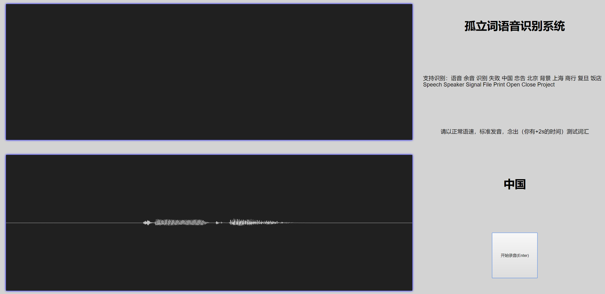

# Speech-Recognition-Via-CNN
孤立词语音识别，复旦大学计算机科学技术学院数字信号处理期末项目

## Introduction

This repo implements a robust speech recognition system that can recognize 20 individual words, such as "Speech", "Beijing", "File", etc. It utilize the mel spectrum feature extracted from raw speech, by treating the spectrums as a pictures, convolution neural network is employed to classify them.

详细中文介绍请参考课程报告。

## How to play

You need a python environment that supports pytorch (version >= 0.4) with CUDA (since the inference process requires GPU) and flask. It is highly recommended to use anaconda to set-up the environment, for more details, please refer to [[conda installation](https://conda.io/docs/user-guide/install/index.html)] and [[pytorch installation](http://pytorch.org)] (for the convenience of users in mainland China, please see [[tuna](https://mirror.tuna.tsinghua.edu.cn/help/anaconda/)]).

After setting up the environment, you can easily launch the recognition service by typing

```bash
python audio_server.py
```

into your command line. This command will start the web service on port 22339, so you can visit it by `localhost:22339`



By click the button, your voice will be recorded and post to the backend which has launched a pretrained model for recognition.

Notice the pretrained file is `save/checkpoint.ptr`, if you want to train the model on your own, you can email me to ask for the training dataset (~2 Giga Bytes).

## 数字信号处理课程YC

2017-2018学年第二学期，最终成绩：A

这门课对于没有模式识别的基础的同学来说，上起来是有点吃力的，不过只要上课听讲应该问题不大。平时没什么事情，没有作业，偶尔点名占10%，少一次扣2分，扣完为止（没事还是不要翘课吧。。），期末考试比较简单占30%，期末PJ60%。薛老师人还挺好（只要你不翘课，否则印象分--），有什么问题可以找他问，挺负责的！

如果想要认真地学，课程容量很大，有很多东西值得学习。这门课的前半部分在EE那边是要完整上一学期的，然后后半部分在爱丁堡大学又是另外一整门课。总体上涵盖了傅里叶分析、采样、信号系统、滤波以及概率论、语音信号处理、模式识别、隐马尔可夫模型。但正是因为容量大，所以讲的都还算简单（反正后半学期我没怎么听过课）。傅里叶分析我之前接触过，所以问题也不太大。学完把所有知识串成一块然后完成课程项目也是非常愉悦的。

给分的话，个人感觉挺不错的。请不要作死交个辣鸡PJ就行了（就算是辣鸡PJ也要吹吹啊，注意交互测试界面的重要性，据我所知两个成绩比较惨的同学都是交互写的有点反人类了+确实效果不咋地），CNN效果贼好，RNN真不行（分类任务使然），然后传统的方法譬如GMM+HMM效果也还说得过去，不过比较难写难训就是了。

推荐指数：😀😀😀😀😀

## 学习资料

课程的ppt在slides文件夹下，我主要参考的书目在reference文件夹下，重点推荐ThinkDSP，谁用谁知道。upload文件夹下有薛老师的录音，可以拿来测试模型。

关于课程项目。librosa了解一下。我用librosa+pytorch完成项目，最终整体代码量在200行以内吧。然后这门课收集语音的工具是我写的 [[DSP-Audio-Collector](https://github.com/ichn-hu/DSP-Audio-Collector)]，最终32个同学提交了录音文件，排除两个质量不足的，有12000个录音文件，共2G左右，如果课程项目题目不变可以用作额外的数据集，对最终的识别效果会加分很多！我之后会放到微云上，有需求的请邮件戳我。


额外我整理了一波往年的期末考试题和我个人的复习笔记，以及考完之后马上把当堂的题目记录了一下，如果有需要请点star并follow然后附上id给我发邮件索取。
